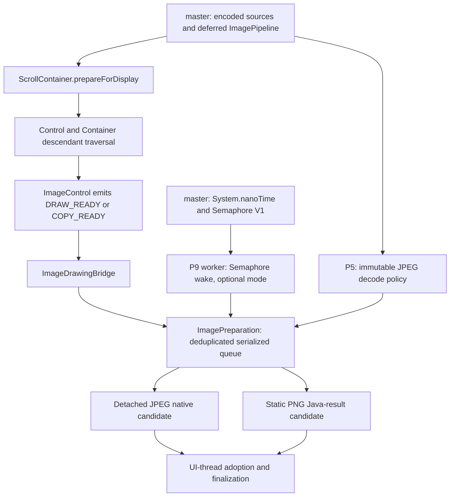

<!--
Copyright (C) 2026 Amalgam Solucoes em TI Ltda

SPDX-License-Identifier: LGPL-2.1-only
-->

# Image decode and prefetch reconstruction specification

## Scope and baseline

This is the implementation contract for P5 `feat/image-lazy-jpeg`, P8
`feat/image-async-prefetch`, P9 `feat/image-prefetch-worker`, and P10
`feat/image-png-prefetch`. It is based on `origin/master` at
`7d50c12c0675fbef13e74c54e59b704c04c08050` (2026-09-30). The current master
already contains `System.nanoTime()` and Semaphore V1. Their implementations
are prerequisites, not work to duplicate in these feature PRs.

Keep this work SDK-side. Preserve `Image` public descriptors, its established
field prefix/VM ABI, and the signatures of `getJpegBestFit` and
`getJpegScaled`. `ScrollContainer.prepareForDisplay(Runnable)` is the one
historical UI entry point required by P8; traversal hooks and the image queue
remain internal. PNG requires no VM or public API addition. Do not carry
benchmark profiles, fault-injection controls, or diagnostic configuration into
production API.

## 1. Dependency graph

P5 supplies the policy-bearing encoded root and stable metadata. P8 supplies
tree discovery, request semantics, detached decode, and UI adoption. P9 changes
only how the serialized queue wakes a worker. P10 adds static PNG as another
candidate producer on that same queue and adoption path.

## 2. Ownership and lifetime table

The source snapshot and request identity are immutable for a request. A worker
may read a source and create a detached candidate; only the UI thread may
publish a decoded backing into the source cache or finalize the display-ready
variant. Ownership transfers exactly once. Any path that rejects a candidate
must release it exactly once.

| Object | Creator and owner | Thread use and transfer | Stale/invalidation and identity | Release, failure, retry |
|---|---|---|---|---|
| Encoded JPEG source | `Image` constructor or JPEG factory captures one `EncodedImageSource`; an immutable `ImagePipeline` root retains it. It owns the copied bytes/native encoded bag and optional decode-failure cache. | Capture, file/stream reads, format inspection, dimensions, and policy metadata are eager. Decode workers may read the immutable bytes/bag. | File path is descriptive, never content identity. Replacing the `Image` pipeline invalidates requests. A changed file after capture has no effect on the snapshot. Use source reference plus device-safe `Vm.identityHashCode(source)` as the numeric key. | Keep source alive after transient decode/allocation failures so a fresh request can retry. Cache deterministic payload failure on the source. Release the native bag only with source lifetime using its idempotent release path; never release it merely because a prefetch candidate was discarded. |
| Encoded PNG source | Captured by the same `EncodedImageSource` path and owned by the encoded pipeline root. | Structural PNG inspection and metadata are eager; static PNG pixel decode runs on the preparation worker through the Java-result route. The source is read-only on workers. | Same source and pipeline identity rules as JPEG. A valid static one-frame PNG is eligible; animated/multi-frame PNG is not. | Keep the encoded source for retry. A Java-result candidate failure does not poison the source unless the decoder identifies deterministic corrupt payload. The source bag follows normal source lifetime. |
| Native JPEG candidate | Decode worker creates a detached native handle from the captured JPEG and the request's captured target, denominator, and optimization mask. Initially owned by the candidate wrapper. | Worker may decode and release the detached handle. UI thread alone adopts it into `NativeImageBacking` and installs it in the encoded source cache. | Reject if the request's pipeline/source is no longer current or its exact request key no longer matches. The path is not consulted. | If decode, UI dispatch, currentness check, adoption, or finalization fails, release the still-detached handle once. Retry by enqueueing a fresh request; do not cache transient failures. |
| Java-result PNG candidate | Preparation worker decodes static PNG into a complete `ImageBacking`; a `JavaResult` wrapper owns it until adoption. | Worker creates the complete result without mutating `Image` or `EncodedImageSource`. UI thread transfers the backing into the encoded source cache, then finalizes the request. | Same request key: `Image` reference, pipeline reference, destination-scale bits, source-content identity, and captured decode metadata. | On stale/failure paths release native-backed results if any, clear wrapper ownership, and leave the source available for a new attempt. Do not count this as a native JPEG decode. |
| Decoded backing | Created by canonical materialization or by a detached candidate and then installed by UI adoption. `EncodedImageSource` owns its reusable decoded-backing slot; pipelines/draw plans may also retain references. | Construction/decode may run on a worker only while detached. Source-cache install, cache generation changes, and final variant creation are serialized on the UI/adoption path. | Validity and decode generation govern draw-plan reuse. Source-content identity and exact scale govern final materialized variants. Source replacement or pipeline mutation makes the old request stale. | A request failure must not overwrite a valid cached backing. For `COPY_READY`, drop the encoded source's cache reference after final materialization but do not explicitly destroy storage still referenced by a sibling draw plan/variant. Eviction advances generation. |
| Prepared entry | `ImagePreparation` creates an entry when no matching queued/in-flight request exists. The process-wide coordinator owns queue membership, state, and callbacks. | Request creation and queue bookkeeping use the coordinator lock. Decode is worker-only; adoption/finalization and completion callbacks are marshalled to the UI thread. | Deduplicate on image object, pipeline object, destination-scale bits, and source-content identity. Merge callbacks and raise the requirement to the stricter of `DRAW_READY`/`COPY_READY`. Remove on every terminal path. | One failed entry reports failure to its callbacks, releases any candidate, clears the active slot, and allows the next entry to run. A later independent request retries. |
| Active batch | `ScrollContainer` creates a batch on the UI thread for one tree traversal. It owns the captured destination scale, generation, pending count, and completion callbacks. | Descendant discovery runs on the UI thread; asynchronous per-image entries report completion back to the batch. | Batch object identity, captured scale bits, and generation prevent an obsolete batch from completing the current scroll request. Tree/content/bounds changes invalidate it. | Invalidation detaches the batch and drops its callbacks. It does not cancel a shared global image entry: that entry may still safely populate a cache if its image/pipeline/source identity remains current. |
| UI adoption candidate | A detached candidate is posted from worker to a UI event closure. Ownership remains with that closure until it transfers to `EncodedImageSource`. | UI thread checks currentness, adopts the native handle or Java backing, then runs the appropriate finish step. | A batch may be obsolete while the individual image request remains current. Reject an image candidate when source/pipeline/request identity is stale; suppress only the old batch callback when just the batch is stale. | On rejection or exception release the candidate and clear the entry's candidate reference. Completion bookkeeping still runs once. |
| Stale/discarded candidate | The candidate wrapper/closure that still owns it performs discard. | Release may happen on the decode worker before posting, or on the UI thread after stale detection; do not publish it first. | Stale means the captured pipeline/source or request key no longer matches. A hash is only a compact key; retain and compare object references to avoid hash-collision acceptance. | Native detached handle uses its detached-release function; a native-backed Java result releases its backing. Clear the handle/reference before terminal callback so duplicate cleanup is harmless. Source remains retryable. |
| Worker/wake state | One process-wide `ImagePreparation` coordinator lazily creates the worker and `Semaphore(0)` when the internal worker mode is selected. The coordinator owns queue, active slot, wake-coalescing flag, and stopping state. | Worker claims one FIFO entry under the queue lock, decodes outside the lock, then posts adoption. It blocks in `acquireUninterruptibly()` when idle. UI completion releases the single active claim. | Worker state is independent of any one `ScrollContainer`; batch invalidation cannot terminate a shared worker. A wake permit is coalesced so idle-to-work transition cannot lose or multiply a wake. | Worker-start failure fails only the next affected entry and drains safely. Process exit ends the process-scoped worker. Test-only shutdown sets stopping under lock, releases a blocked wait, joins outside the lock, and clears test state. |

## 3. P5 reconstruction map — lazy JPEG

### Final architecture

1. Add an immutable package-private `ImageDecodePolicy` carried by the encoded
   root of `ImagePipeline`. It has `TARGET_DECODE`, `BEST_FIT(targetWidth,
   targetHeight)`, and `EXPLICIT_RATIO(numerator, denominator)` intents. Ordinary
   encoded images use `TARGET_DECODE`; the two legacy JPEG factories create a
   policy-bearing root with output dimensions known immediately.
2. `getJpegBestFit(path, width, height)` and
   `getJpegScaled(path, numerator, denominator)` keep their existing public
   signatures and eager argument checks. They eagerly capture exactly one
   immutable JPEG source, validate that it is JPEG, and compute checked output
   metadata. They return an `Image` whose payload pixels are still deferred.
3. Path open/read errors, null/unsupported path input, invalid scale arguments,
   invalid JPEG structure/header, unsupported format, invalid dimensions, and
   output-dimension overflow remain eager failures. Container structure and
   metadata inspection do not inflate compressed pixel data. Corrupt compressed
   payload with otherwise valid framing is discovered at the first materialize
   or draw barrier.
4. Preserve the native encoded JPEG bag until decode or final source disposal;
   do not convert the JPEG to a raster during factory construction and do not
   reopen/re-read the path later. The captured source is the authority for both
   metadata and decode.
5. Resolving a `BEST_FIT` policy chooses the existing largest safe native
   reduction from the limiting target axis, then validates the decoded output
   against the dimensions recorded at construction. `EXPLICIT_RATIO` passes the
   requested positive ratio directly to the native decoder. JavaSE preserves
   its established fallback: best-fit uses a compatible tiered decode; explicit
   ratio decodes from the captured source and applies the existing smooth scale
   only if needed. Do not change the ordinary `TARGET_DECODE` selection or
   broaden reduced-resolution decode to other formats.
6. Cache deterministic payload/metadata decode failures on the immutable
   source and rethrow them on later materialization attempts. Decoder setup,
   allocation, thread, and other transient resource failures are not cached;
   failed resolution leaves the deferred `Image` and encoded source intact for
   retry. Publish/adopt only complete validated state.
7. Preserve output width/height, logical dimensions, scale behavior, comments,
   error boundary, and `Image` ABI. Do not add a public lazy-loading switch or
   alter the factory descriptors.

Keep diagnostics and fault injection separate: production may retain only
failure-only counters where necessary. Decode counters, forced target policy,
and injected allocation/adoption failures are test-only.

### P5 files/functions

Fold the policy through `ImagePipeline`, `Image.initializeDeferredJpegFactory`,
`Image.materializePipelineRoot`, `Image.materializeExplicitJpegPolicy`,
`Image.getJpegBestFit`, `Image.getJpegScaled`, and
`EncodedImageSource.decodeFailure/cacheDecodeFailure`. Add
`ImageDecodePolicy.java`. Preserve the existing source capture and decode
helpers rather than creating a second file-loading path.

## 4. P8 reconstruction map — asynchronous display preparation

### Public and traversal boundary

Keep the single asynchronous entry point `ScrollContainer.prepareForDisplay`
with its completion callback. Post discovery to the main UI thread, capture
`Graphics.getMainWindowContentScale()` once, and snapshot the exact scale bits
and batch generation. Coalesce another call into the current batch only when
both generation and scale match; otherwise supersede/invalidate the old batch.
Only the current batch may run its completion callbacks.

Add package-private preparation hooks to `Control`, recursive traversal in
`Container`, and image collection in `ImageControl`. Traverse the existing
control tree, including both the primary image and distinct `imgBack`. Use
`DRAW_READY` when `allowBeyondLimits` is true and `COPY_READY` otherwise. Do
not invent a virtualized-list API. Invalidate the owning `ScrollContainer`
batch on child add/remove, bounds/resize changes, or ImageControl image
replacement/mutation.

### Readiness levels and queue

- `DRAW_READY`: prepare the destination-scale draw plan so first display avoids
  decode/plan creation. Do not force a final image raster if the plan can draw
  from its root.
- `COPY_READY`: on UI adoption resolve the destination-scale final materialized
  image, clear transient draw plans, and drop source ownership of intermediate
  decoded backing. Do not explicitly free a backing shared by another plan.
- The request captures `Image`, exact `ImagePipeline`, source reference and
  device-safe `Vm.identityHashCode(source)`, destination-scale bits, target
  dimensions, decode denominator, native availability, and optimization mask.
  The source reference/pipeline identity are authoritative; path strings and
  hash alone are not.
- Keep one global FIFO queue and one active entry from decode through UI
  adoption/finalization. Deduplicate matching requests and accumulate
  callbacks; upgrade an in-flight `DRAW_READY` entry to `COPY_READY` if needed.
- Decode into a detached native JPEG handle on deployed native targets, or a
  detached Java result where native JPEG decode is unavailable. Never mutate a
  live `Image` from the worker. Marshal every adoption/finalization to the UI
  thread.
- If the source was already decoded, skip background decode but enqueue an
  asynchronous UI continuation when a main window exists. Do not finalize
  inline from request submission or recurse through a chain of already-decoded
  entries. The no-window fallback is for tests/non-UI contexts.
- An image request becomes stale when pipeline/source/request identity changes.
  Reject and release its candidate before install. A batch becoming stale only
  suppresses that batch's callbacks; a still-current deduplicated image entry
  may finish safely for cache reuse. All callbacks and active-slot cleanup are
  terminal and exactly once.
- Transient decode/adoption failures report `FAILED`, release intermediates,
  leave the authoritative encoded source available, and permit a later request
  to retry. Unsupported pipeline shapes/formats report `NOT_PREFETCHABLE` and
  use the ordinary draw path.

The queue owns entries until terminal completion. No unbounded cache or general
eviction policy is part of prefetch. Reuse is bounded by the existing source and
pipeline cache rules.

## 5. P9 reconstruction map — Semaphore worker

Use the `java.util.concurrent.Semaphore` one-permit surface already supported
by master (the deployed compatibility implementation is
`jdkcompat.util.concurrent.Semaphore4D`) and its existing native implementation.
Use `totalcross.util.concurrent.Lock` as the monitor object for every
coordinator `synchronized` section; do not replace it with a raw `Object`,
`wait/notify`, or another synchronization primitive. The semaphore is internal
and initialized with zero permits.

- The queue remains FIFO and globally serialized. The worker owns decoding only;
  the UI owns candidate adoption and finish. Keep the active claim until UI
  finalization completes so two candidates cannot race to populate one source.
- Start one process-scoped worker lazily when worker scheduling is selected
  and eligible work is queued. While idle it blocks in
  `acquireUninterruptibly()`. Enqueue under the queue lock; if the worker is
  waiting and no wake is pending, set the pending flag and call `release()`
  once. Clear the flag after acquire under the same lock, then re-check queue
  and stopping state. This prevents lost wakeups and permit accumulation.
- Do not poll, sleep, or busy-wait. Treat idle semaphore wait as suspended state.
  A worker awakened with no work rechecks state and blocks again. Start failure
  fails one entry and does not strand the remaining queue.
- The worker belongs to the process coordinator, never a `ScrollContainer`.
  It remains parked for the process lifetime; process exit ends the worker.
  There is no per-view shutdown or new VM shutdown API. A test-only stop hook
  sets stopping under lock, releases a blocked wait, observes shutdown in the
  loop, and joins outside the lock. Do not expose start/suspend/shutdown
  methods publicly.
- Preserve the historical `legacy` production default (short-lived serialized
  preparation thread) until comparable repeated workload evidence supports a
  broader switch. The semaphore worker can exist behind an internal rollout
  policy, but do not add production poll/semaphore modes, sleep knobs, or a
  public worker-forcing switch. `System.nanoTime()` is available if later
  runtime-optional coarse timing is approved; do not time every production
  request by default.

The Semaphore V1 commits already on master are a dependency only:
`1ba5acb03` (native blocking support) and `e55228617` (SDK compatibility
mapping). The monotonic clock prerequisite is `af54bc9cb`. Do not replay these
commits into P9.

## 6. P10 reconstruction map — static PNG

Extend `Image.createPreparationRequest` to recognize exactly a captured PNG
source with `frameCount == 1`. Set denominator to 1 and use the Java-result
candidate route through the existing queue, deduplication, state machine, UI
adoption, and cleanup. Decode a detached complete backing on the worker; install
it into the source cache only after currentness checks on UI. Keep `COPY_READY`
and `DRAW_READY` semantics identical to JPEG.

Animated/multi-frame PNG and unsupported formats remain
`NOT_PREFETCHABLE`; APNG-specific behavior, format expansion, decoder/VM
redesign, and a new public API are out of scope. Release a stale Java-result
backing and any partially created native resource deterministically. Retry
transient errors from the original encoded source.

Keep accounting boundaries honest: PNG Java-result decode is not a native JPEG
decode and must not increment targeted/full native JPEG decode counters. Any
retained failure-only counter may report PNG request failure separately. Do not
carry per-request timings or six-process benchmark counters into normal
production operation.

## 7. State machine and invalidation rules

```mermaid
stateDiagram-v2
  [*] --> Queued
  Queued --> Decoding: eligible source, not already decoded
  Queued --> Adopting: already decoded; async UI continuation
  Decoding --> Adopting: detached candidate posted to UI
  Decoding --> Failed: decode/start failure
  Adopting --> Ready: current identity, adoption and finish succeed
  Adopting --> Failed: stale identity, adoption or finish failure
  Ready --> [*]
  Failed --> [*]

  state "ScrollContainer batch" as Batch {
    [*] --> Discovering
    Discovering --> Waiting: discovered requests > 0
    Discovering --> Complete: no requests
    Waiting --> Complete: pending reaches zero and batch still active
    Discovering --> Invalidated: tree/scale/content changed
    Waiting --> Invalidated: tree/scale/content changed
  }
```

Entry state transitions are serialized. `READY` and `FAILED` are terminal;
every terminal path clears active/pending membership, detaches callbacks,
releases unadopted candidates, and permits the next entry. Batch invalidation
does not rewrite source identity or cancel a deduplicated entry used by another
caller. It only prevents obsolete batch completion. Source replacement or
pipeline mutation rejects the candidate even if the batch is still active.

## 8. Diagnostics migration

Apply the D boundary:

- A small failure-only production counter is acceptable if operationally useful.
- Coarse request/outcome/state/timing diagnostics may be added later behind a
  runtime-optional diagnostics setting; they are not required for this feature.
- Poll/sleep/wake comparison metrics, forced worker mode, thread lifecycle
  metrics, and fault injection are test-only. They must not become public API or
  execute on production hot paths.

Apply the E boundary: the six-process diagnostics profile is a one-off. Keep
only the feature-owned workload concepts that still provide repeatable
functional coverage. Do not copy the generic profile/runner or Windows
packaging/process-control machinery wholesale. It may be rebuilt later for a
separate evidence task. Raw logs, result trees, packages, SDK overlays, and
temporary artifacts do not migrate into this feature.

## 9. Tests to retain, rebuild, or drop

| Area | Retain/rebuild | Drop |
|---|---|---|
| P5 factories | Preserve public descriptor/metadata tests; eager path, argument, format and header errors; deferred payload decode; best-fit and explicit-ratio parity; deterministic error cache; transient retry; single captured source; converter/native source capture. | Forced production policies, per-decode production timing, stale benchmark logs. |
| P8 lifecycle | Rebuild focused `ImagePreparationTest` and `ScrollContainerPreparationTest` coverage for traversal, both ImageControl images, DRAW/COPY parity, unsupported fallback, scale capture, batch coalescing/invalidation, shared-source dedup, device-safe identity, already-decoded async continuation, FIFO serialization, stale candidate release, transient retry and callback exactly-once behavior. Keep deployed native smoke for detached-handle adoption and no extra copyRect decode. | Superseded benchmark-only startup/frame hooks and earlier `final/` / `final-fixed/` raw matrices. |
| P9 worker | Keep semaphore blocking/wakeup contract tests, wake coalescing, FIFO/one-active-entry, queue drain after failure, start/stop wakeup, and default-legacy assertion. Keep fault injection and mode selection inside tests. | Poll-vs-semaphore runtime plumbing, sleep knobs, comparative counters, worker forcing in product API. |
| P10 PNG | Keep one-frame PNG eligibility, denominator-1 Java-result adoption, animated PNG rejection, stale/failure cleanup and retry, deployed smoke, and explicit assertion that JPEG native counters do not move for PNG. | PNG benchmark/process profiles, raw six-row CSV/log set, Windows ZIP/package and temporary SDK overlay. |

Tests remain SDK-focused. The task requires no builds; implementation should run
the smallest focused suite for the changed layer and an exact deployed smoke
only where candidate/native adoption changed.

## 10. Historical mapping and disposition

The names in the “final owner” column are the P5/P8/P9/P10 task labels. The
historical source branches used `perf/image-jpeg-factories-lazy`,
`perf/image-scroll-prefetch`, and `feat/png-prefetch`. `KEEP` means preserve
behavior/tests in the final owner; `FOLD` means merge useful evidence/docs into
that owner without separate product tooling; `MOVE` means the work belongs to a
prerequisite or focused test suite; `DROP` means it must not ship.

| Historical group | Class | Final owner | Contribution and final targets | Supersession / useful tests |
|---|---|---|---|---|
| `0d38f20fb` explicit JPEG policies; `21a296231`, `64c0b1d6e` policy/factory tests; `c97c6eebd` converter coverage | KEEP | `feat/image-lazy-jpeg` | `ImageDecodePolicy`, `ImagePipeline` policy root, `Image.java` factories and explicit-policy materializer. | Later `be36aec42` and missing-file contract correction win on source capture. Retain policy, factory signature, and converter tests. |
| `be36aec42` native JPEG source capture; `bb2e2f745` missing-file exception contract | KEEP | `feat/image-lazy-jpeg` | One captured immutable JPEG source; eager path failure contract; delayed payload pixels. | Supersedes duplicate/earlier `3dd8ccd78` capture attempt. Retain native bag, exact exception-boundary, and no-reread tests. |
| `23762d7d2`, `43ee2a695` JPEG factory repair/hardening; `b3a8500f0` external blocker; `70730692f` handoff | FOLD / DROP | `feat/image-lazy-jpeg` | Keep validated factory behavior and final concise compatibility notes. | Repair commits are superseded by policy implementation and source-capture fixes; drop the stale blocker as a product constraint. Keep the handoff only as rationale, not as runtime behavior. |
| `5044c4b53` traversal; `d241d6d36` ScrollContainer descendants; `c8782cf29` async display prep | KEEP | `feat/image-async-prefetch` | `Control.prepareForDisplay`, `Container.prepareForDisplay`, `ImageControl.prepareForDisplay`, `ScrollContainer.prepareForDisplay`, `DisplayPreparation`, `ImageDrawingBridge.prepareForDisplay`, and `Image.createPreparationRequest/adopt/finishPreparation`. | Retain traversal and public callback behavior tests. |
| `deea03ee3` async hardening; `f26186a3f`, `807e066ac`, `63eeedd53` intermediate/native cleanup | KEEP | `feat/image-async-prefetch` | Detached candidates, exactly-once release, `COPY_READY` finalization and safe source-cache drop. | These late fixes supersede the first `final/` behavior. Retain native cleanup, stale candidate, parity, and fallback tests (`468016e44`). |
| `691641759` decode/adoption chain; `fa21e56ed` shared source prep; `113bdb993` device-safe identity | KEEP | `feat/image-async-prefetch` | UI adoption chain, coalescing key, shared immutable source correctness. | `155ae881c` lifecycle tests remain valuable. Compare source/pipeline references as well as numeric identity. |
| `971ab66e6` already-decoded deferred adoption; `de7001337` TCVM-compatible preparation lock | KEEP | `feat/image-async-prefetch` | Always queue an asynchronous UI continuation when already decoded; use compatible lock; one slot through finalization. | Supersedes inline/recursive already-decoded scheduling. Retain queued-continuation, completion, no-extra-decode, and lock tests. |
| `8d67a78c8`, `2ea1b67a1`, `06b6eb4c4`, `1366933e0`, `37368d04b`, `ca6972791` prefetch workload/evidence/closeout | FOLD | `feat/image-async-prefetch` | Keep only the workload definition and final qualitative evidence needed to validate copy-ready behavior. | Authoritative result was `final-definitive-pass`; `final/` and `final-fixed/` were superseded. Do not migrate raw matrices or benchmark hooks. |
| `2d3d41ae2` serialized worker; `9913a6847` Semaphore wake integration; `1953ad05a` lifecycle tests | KEEP | `feat/image-prefetch-worker` | `ImagePreparation.request/scheduleNext/runPrefetchWorker/awaitSemaphoreWake/releaseSemaphoreWakeLocked`; single worker, queue serialization, process-scoped idle wait. | Use Semaphore V1 from master. Keep blocking, wake coalescing, queue drain, and default-legacy tests. |
| `af54bc9cb` `System.nanoTime`; `1ba5acb03`, `e55228617` Semaphore V1; master closeout `7d50c12c0` | MOVE (already on master) | `system.nanoTime` / Semaphore V1 prerequisite PRs | Reuse existing API and native support directly; no duplicate SDK/VM changes in P9. | Preserve prerequisite tests in their owners; do not import their diagnostics or validation artifacts. |
| `e6e15cf94`, `75fda6ef2`, `a40d0b4fb`, `b4c575086`, `a0fdff260`, `fbc53cb26` worker diagnostics and mode comparisons | MOVE tests; DROP production plumbing | `feat/image-prefetch-worker` test suite | Retain only contract tests that prove lifecycle and scheduling correctness. | Poll/sleep/wake counters and forced worker-mode controls are test-only; no broad default change is justified by one-run comparisons. |
| `efc679d88` static PNG eligibility; `689e27daf` deployed PNG coverage | KEEP | `feat/image-png-prefetch` | `Image.createPreparationRequest/createJavaPreparationResult`, Java-result candidate adoption, PNG unit and deployed smoke tests. | Keep JPEG behavior and `legacy` default. Keep static-vs-animated PNG and release/discard tests. |
| `4549dadd2`, `0ef3606c4`, `1dee61893`, `0e795af3c`, `28aaf3357`, `d7a9ec93f` PNG plan, evidence and rollout closeout | FOLD | `feat/image-png-prefetch` | Keep durable functional constraints and limitations only. | Do not import one-off benchmark tooling, raw files, result bundles, Windows package, or frame-performance claims. |
| `e391aaf11`, `9eeb3f88b`, `e943afd43` benchmark phase diagnostics; six-process profile and Windows packaging/process-control work | DROP (rebuild separately if requested) | None in product | No production targets. Reusable corpus scenarios can inform feature-owned tests only. | One run per strategy is descriptive and does not establish a scheduler win or causal frame improvement. Raw logs/packages are excluded. |

### Tooling disposition

Do not migrate the generic six-process profile, polling/semaphore matrix runner,
Windows packaging scripts, process-control helpers, generated package, SDK
overlay, or raw result/log trees. Retain only focused test fixtures and the
small repeatable workload concepts owned by the corresponding feature. Rebuild
cross-platform diagnostics as a separately scoped task if new comparable
measurements are later needed.

## 11. Ordered implementation checklist

1. Start from the baseline in this document. Confirm `System.nanoTime()` and
   Semaphore V1 on master; do not cherry-pick their implementation.
2. Implement P5 immutable JPEG policy roots and factory materialization while
   preserving eager argument/path/metadata contracts. Add deterministic-cache
   versus transient-retry tests.
3. Implement P8 traversal, scale-captured batches, readiness requirements,
   request identity, the serialized queue, detached JPEG candidates, UI-thread
   adoption, terminal cleanup, and the final already-decoded continuation.
4. Integrate P9 semaphore wake behind internal worker policy. Preserve FIFO and
   one active entry through UI finish. Keep `legacy` as broad default; omit
   polling and diagnostic mode selectors from production.
5. Add P10 static one-frame PNG through the Java-result candidate route at
   denominator 1. Add explicit cleanup and JPEG-accounting boundary coverage.
6. Remove/avoid fault injection and comparison metrics from product code. Keep
   focused functional tests and feature-owned smoke workloads only.
7. Review the final diff for public descriptors/field ABI, run focused tests and
   the relevant deployed adoption smoke, validate headers and whitespace, then
   commit the specification/feature artifacts separately under their owning
   PRs. Do not add raw benchmark outputs or generated packages.

## 12. Genuine unresolved questions

None for the architecture described here. The worker remains internal and
process-scoped; process exit ends it, while per-view lifecycle remains
explicitly out of scope.
