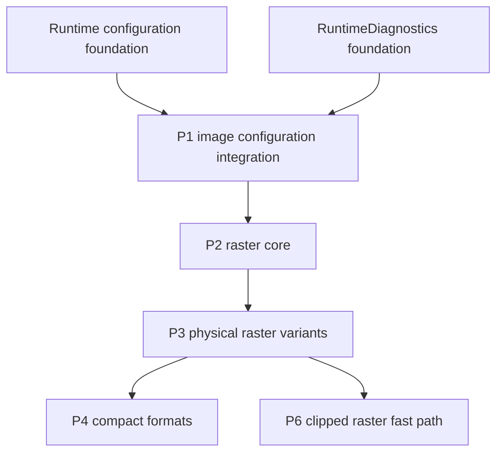

<!--
Copyright (C) 2026 Amalgam Solucoes em TI Ltda

SPDX-License-Identifier: LGPL-2.1-only
-->

# Image raster reconstruction specification

This is the implementation contract for four reconstructed PRs. It uses
historical branches as evidence, not as patches to replay. The analysis branch
was created from `origin/master` at `7d50c12c0675fbef13e74c54e59b704c04c08050`.
The historical image branches share the older source base
`e9b32a740019f858181d41449dc424b4d598348a`; later corrections are included
below even when they landed after their original feature branch.

Historical evidence refs:

| Evidence | Ref and tip | Use |
| --- | --- | --- |
| Optimization controls | `origin/perf/image-opt-phase1-controls` at `4ee0f71527c242b5171753ed4350aefadd3ad2b0` | Historical option IDs and test controls; P1 owns their replacement. |
| Raster core and variants | `origin/perf/image-opt-phase2-raster` at `77b5275b35a52a064c4170165f44687c8c03d948` | Core raster and physical-variant implementation. |
| Compact formats | `origin/perf/image-opt-phase3-formats` at `2555d63bd0be366790546315eb8947fd1e91b0c2` | Compact storage, promotion, decoder integration, and final-stack fixes. |
| Clipped raster path | `origin/perf/image-scroll-raster-fast-path` at `377c3c9d0f5e77de9cfca45b91377fe905651e9e` | Physical clip planning and no-op contract. |
| Final raster/copyRect corrections | `origin/codex/scroll-raster-reuse-windows-package` at `f5dad132cafea5c9086f6f946a6f44ca5bcb5f76` | Later cached-copy, fallback, and eviction fixes. |
| Runtime diagnostics inventory | `origin/analysis/runtime-diagnostics-inventory` at `1a0603804` | Metric classes, cost boundaries, and native bridge disposition. |
| Performance tooling audit | `origin/analysis/performance-tooling-audit` at `02d9e2e7d` | Durable fixture, benchmark, and generated-evidence disposition. |

## 1. Dependency graph

P2, P3, P4, and P6 add no public optimization API. P1 alone maps named
runtime-configuration options to image behavior and owns defaults. Consume the
RuntimeDiagnostics foundation through its internal aggregate snapshot contract;
do not create a second image metric registry. P6 requires P3's physical
identity and one-slot variant mechanisms. P4 can land before P6 for the planned
sequence, but P6 does not require compact storage and must remain correct when
P4 is disabled.

Historical option numbers are evidence only:

| Historical IDs | Meaning | Reconstruction owner |
| --- | --- | --- |
| 0–4 | Zero-copy decode, opacity metadata, opaque `writePixels`, row readback, direct-color materialization | P1 names/configures; P2 consumes. |
| 5–7 | RGB565, GRAY8, ARGB4444 storage | P1 names/configures; P4 consumes. |
| 8–12 | Byte-budget, pressure eviction, GPU backing discard, mmap, and ad-hoc diagnostic accounting reservations | Drop; do not create inert options. |
| 13–14 | Target color conversion and physical variant cache | P1 names/configures; P3 consumes; neither defaults on in this reconstruction. |
| 15 | Physical identity folding | P1 names/configures; P3 consumes without changing its configured default. |

## 2. P2 — `perf/image-raster-core`

**Purpose and final state.** Keep an authoritative native raster backing and
remove avoidable full-image copies for eligible decode, draw, readback, and
color operations. All paths preserve the existing public `Image` results and
fall back to the current decoder/renderer when the safety proof is incomplete.
P2 does not add a cache, compact format, public setting, counter API, or
benchmark selector.

**Historical commits containing behavior.**

- Decode ownership and retry: `8d1314b78de62bb653f77f5936553ce5ba192b30`
  (decode into native backing), `07a3ffc9978bed08e256327a1b8de6b1272253b1`
  (channel order), and `4094d1d5e7dddc621b3cbbb79da7ad9cc8bf091c`
  (wrapped retry failures).
- Opacity proof and opaque copy: `0eb9e080c60799908860afabf7fd9533ed4d5cec`
  (backing opacity), `fa000f09d6ea5540513dea4c020a484846cc3a5a`
  (`writePixels` fast path), and `86a3a8e6ea863b76e5ee58dfd09a322143bf9d01`
  (mutation invalidation).
- Bounded readback and color: `84b9c2792be1a2f4b0af8cd7714ceeac3916214f`
  (bounded scratch), `1cabb9d85982965e381679766851cc577c1ce1bc`
  (row bridge), and `f95bdffba778661f0e4dad38248d5661766f6e62`
  (direct `APPLY_COLOR2` parity, including alpha inputs such as `0xAAxxxxxx`).
- Draw plans and mutable targets: `6d363a738789778d87744e81a02089f526cd902a`
  (trivial draw-plan copy), `2e9612b08388aefc0cdb7dcac8e9a8f4a0be7100`
  (materialize mutable Graphics targets), and
  `e5b25bcc024d9173468174b9ac2658278ff18f80`
  (decode ownership, cleanup, and stable masks). The failure-injection bridge
  was added by `79b1763f654ce95a509d6c0b4a92eaf82c2d2da8` and remains test-only.

**Files and owners.**

- Java: `Image.java` owns decode/fallback decisions, opacity use, and
  materialization; `NativeImageBacking.java` owns the opaque native handle and
  internal backing operations. Keep existing public factories and color APIs
  unchanged. Keep `ImageDrawPlan`/`ImageDrawingBridge` internal.
- VM decode and bridge: `TotalCrossVM/src/nm/ui/image_Image.c`,
  `image_NativeImageBacking.c`, `image/ImageDecodeStatus.h`,
  `init/nativeProcAddressesTC.c`, `nm/NativeMethods.txt`,
  `nm/NativeMethodsPrototypes.txt`, and `nm/NativeMethods.h`.
- Raster ownership and operations: `nm/ui/skia/skia_image_backing.cpp`,
  `skia_image_backing_internal.h`, `skia_image_color.cpp`,
  `skia_image_geometry.cpp`, `skia_image_geometry_internal.h`,
  `skia_image_geometry_materialize.cpp`, `skia_primitives.cpp`,
  `skia_surface.cpp`, `nm/ui/gfx_Graphics.c`, and
  `nm/ui/GraphicsPrimitivesSkia_c.h`.
- Decoder integration: `TotalCrossVM/third_party/jpeg/JpegLoader.c`,
  `JpegLoader.h`, and `third_party/png/PngLoader.c`.

**Architecture, ownership, and invalidation.**

1. A `NativeImageBacking` owns one native raster handle and its pixel storage.
   Direct decode transfers the final decoded pixels to that backing exactly
   once; it must not retain a decoder scratch buffer or make an unnecessary
   second full-image copy. Java references control handle lifetime, and release
   consumes the handle once.
2. Zero-copy decode is an optimization of the existing decode result. If its
   allocation, format, or handoff proof fails, discard partial native state and
   use the established copied decode path. A transient allocation failure
   leaves the `Image` retryable. Longjmp/error cleanup frees staging/native
   allocations exactly once. The decode mask is stable process state derived
   from P1 settings; never toggle it around an individual decode call.
3. Opacity is `UNKNOWN`, `OPAQUE`, or `TRANSLUCENT` for a backing generation.
   Accept only trusted source/decode proofs or a complete pixel scan. Opaque
   `writePixels` is allowed only when the source proof, 1:1 geometry, target,
   clip, blend/alpha state, and write bounds all qualify. Metadata controls
   whether a proof is cached; they do not weaken the write guard. If opacity is
   unknown and metadata is disabled, at most one full scan per generation may
   establish the proof.
4. Readback uses a single RGBA row scratch bounded by `width * 4` bytes and
   batches row transfer through one native bridge call per image. Convert each
   row directly to the caller's canonical ARGB output. Do not allocate a
   height-sized temporary image for readback or color materialization.
5. Direct-color materialization must preserve legacy `APPLY_COLOR2` arithmetic:
   compute output alpha from the original RGB channels before overwriting them.
   The native result must match the established Java/legacy semantics for
   alpha-bearing inputs, including `0xAAxxxxxx`.
6. Any mutation through a `Graphics` surface alias advances the shared backing
   generation and changes cached opacity to `UNKNOWN`. A write through a
   mutable image target first obtains mutable storage instead of modifying a
   backing still shared as an immutable source. Generation is the invalidation
   token for derived state added by P3.
7. Failed fast-path eligibility or failed native allocation returns to the
   established generic/copy path without exposing a partially initialized
   backing. A failed optimization must not change pixels or public exception
   behavior.

**KEEP / FOLD / MOVE / DROP.** Keep direct decode, opacity proof, guarded opaque
copy, bounded row readback, direct color, and trivial draw-plan behavior. Fold
the alpha parity, mutation/alias generation invalidation, longjmp cleanup,
retry, stable-mask handling, mutable-target behavior, and target guards into
this owning PR. Move optimization selection to P1 and useful aggregates to
RuntimeDiagnostics. Keep failure injection, counters, and synthetic factories
test-only. Drop inert budget/pressure/GPU-discard/mmap switches and historical
benchmark output from production.

**Regression floor.** Preserve JPEG and PNG pixel parity for zero-copy and
copied decode; retry after injected allocation/decode failure; release and
ownership exactly once; source opacity proof and transparent fallback; opacity
invalidation after direct and aliased mutation; opaque `writePixels` hit and
all eligibility fallbacks; bounded `getPixels`/encode/color readback parity;
`APPLY_COLOR2` alpha parity; trivial draw-plan copy parity; and mutable-target
generation/opacity behavior. Failure hooks must be inaccessible to production
callers.

## 3. P3 — `perf/image-raster-variants`

**Purpose and final state.** Avoid repeated physical resampling or target-color
conversion on the software raster backend with exact identity folding and one
bounded source-owned variant slot. The canonical source backing remains the
source of truth. No GPU cache or second Java-side cache is introduced.

**Historical commits containing behavior.**

- Physical identity: `ec0c6dfcc533ae495d7eb5515be255a728a7d845`.
- Target-color and physical variants:
  `69e5408ff6a5a27c69b045375d2fe972fee50837`,
  `dba63167c63481914db6435aa8bc3d12b90327ee`, and
  `e5546ede8c6d9a02e0abef12fbeda5c34deba353`.
- Native test-raster registration/signature corrections:
  `a264e04bd28c173b1042e7d3bdcca3573e99f225`,
  `cb145c552711e5c1f6859b8aca2af6c6795053ca`, and
  `3993bb5dd5801064ab072a1a13f9591ceb33712f`.
- Generation/replacement coverage and final guards:
  `fdff984377f5343095120589b5ab2b543be09af3`,
  `274757eedbc8aa950f6e91cd7257d75d2a654ea5`, and
  `4d91bd5b4790dcc3ecdb8d7f2bfffbe23b8cd5de` (do not evict/release the
  equivalent variant just installed).

**Files and owners.**

- Java internal bridge: `Image.java`, `NativeImageBacking.java`,
  `ImageDrawPlan.java`, and `ImageDrawingBridge.java`.
- Native planner/cache: `TotalCrossVM/src/nm/ui/skia/skia_image_geometry.cpp`,
  `skia_image_geometry_internal.h`, `skia_image_backing.cpp`,
  `skia_image_backing_internal.h`, `skia_image_color.cpp`, `skia.h`,
  `image_NativeImageBacking.c`, plus matching generated/native method
  registration files for any retained internal/test bridge.

**Architecture, key, and lifetime.**

1. In `geometryDraw`, test exact physical identity before consulting the
   variant slot. Identity means an axis-aligned software-raster draw whose
   clipped visible mapping is exact integer physical 1:1. Keep crop/frame
   selection identity when the selected source rectangle maps exactly. Do not
   accept near-identity rounding, rotation/skew/perspective, dynamic hardware
   scale, alpha/save/blend state that cannot be proven equivalent, or a
   non-software/GPU target. Preserve the independent P2 `writePixels` path.
2. One native slot per source backing stores either the currently admitted
   target-color conversion or physical raster variant. It is bounded to one
   derived raster; replacing its key releases the displaced entry without
   creating a second cache. Keep canonical ARGB readback on the original
   source.
3. Build the key from source/backing identity, source generation, decode
   generation, operation/frame/crop/scale parameters using exact scalar/float
   bits, physical output dimensions, and target color type. Exclude destination
   x/y, viewport position, and scroll offset so an otherwise identical variant
   can be reused while scrolling.
4. Use the historical conservative admission: first identical eligible draw
   records the key; the next may materialize; subsequent exact-key draws hit.
   A different key replaces the pending/materialized slot. Publish a new
   materialization only after it succeeds. If it is equivalent to the current
   physical raster, retain the current entry instead of evicting it.
5. Source-root mutation, backing generation change, decode generation change,
   or source replacement invalidates both the pending key and stored variant.
   Target-color conversion is allowed only for supported opaque content and
   BGRA8888/RGB565 targets; RGBA remains canonical. Translucent content and
   unsupported targets use the established generic software path.
6. When disabled or ineligible, do not touch cache state; draw the source via
   the existing geometry/resampling path. Allocation/materialization failure
   leaves the source valid and falls back without partial pixels or a stale
   slot. Keep paths software-only at compile and runtime boundaries; GLES/GPU
   must use its normal renderer.

**API and rollout.** The slot, key, and plans are private implementation
details. P1 alone maps configuration to named runtime options. In particular,
historical IDs 13 and 14 stay disabled by default; P3 must not turn them on.
Do not publish masks, cache counters, or a test factory.

**KEEP / FOLD / MOVE / DROP.** Keep exact identity, eligible target-color
conversion, and the bounded physical variant. Fold native registration fixes,
identity-before-lookup ordering, decode-generation checks, equivalent-entry
retention, and replacement/eviction cleanup directly into this PR. Move only
coarse hit/materialization/fallback/bytes aggregates to RuntimeDiagnostics;
detailed key transitions and rejection causes are compile-time/test-only.
Drop GPU variants, approximate geometry, duplicate caches, and default-on
IDs 13/14.

**Regression floor.** Retain exact identity hit and non-identity fallback;
BGRA8888 and RGB565 conversion parity; translucent fallback; first-use,
repeat-hit, one-slot replacement, equivalent-entry retention, and eviction;
source mutation, alias generation, decode-generation, crop/frame and size
invalidation; identity precedence over cache lookup; disabled parity; and
canonical source readback. Keep native method owner/name/signature and address
registration in lockstep for test-only probes.

## 4. P4 — `feat/image-compact-formats`

**Purpose and final state.** Add opt-in source backing formats RGB565, GRAY8,
and premultiplied ARGB4444. Existing APIs and observers continue to see the
same logical image and canonical ARGB pixels. RGBA8888 remains the universal
fallback and mutation format.

**Historical commits containing behavior.**

- Initial compact backing and format dispatch:
  `b9feca70ca01b8803c1aed6dc6084ee09abf1aae`.
- Compact `writePixels` row conversion:
  `ceb42f4c2a9061433adcbb3f07c96146bad4aa13`.
- Corrected compact decode accounting/opacity and shared target-color dispatch:
  `09519d4ee20f68bbaec1c85d0c84d3c952e8cecb` and
  `c2cf2fb1d1f95a79cf3f3c3dbe8100701538b6d4`.
- Format/promotion and combined correctness coverage:
  `9456fc29dc407ecba26eb9544e62d9f2747b2a75`,
  `02c1f383453df172cc121f611242a72e4858ee2f`,
  `b2fac0d835469e7e018decfca29939d232d9bf9f`, and
  `f2ff0f5e3d41e5d6072de40e62193b19afbff7f9`.

**Files and owners.**

- Java: `Image.java` selects policy and promotes on mutation;
  `NativeImageBacking.java` owns/readbacks the format-tagged native backing.
- Shared/native format dispatch: add internal enums in
  `TotalCrossVM/src/nm/ui/ImageBackingFormat.h` and
  `nm/ui/image/ImageDecodeFormat.h`; integrate `image_Image.c`,
  `image_NativeImageBacking.c`, `skia_image_backing.cpp`,
  `skia_image_backing_internal.h`, `skia_image_color.cpp`,
  `skia_image_geometry.cpp`, `skia_primitives.cpp`, and the P2 readback path.
- Decode: update `TotalCrossVM/third_party/jpeg/JpegLoader.c/.h` and
  `third_party/png/PngLoader.c` so metadata selection and final storage agree.
- Registration contract: keep `NativeImageBacking.currentFormatNative()`,
  its `tuiNIB_currentFormatNative` implementation, the method descriptor in
  `nm/NativeMethods.h`, `nm/NativeMethods.txt`, and
  `nm/NativeMethodsPrototypes.txt`, and
  `init/nativeProcAddressesTC.c` synchronized **only if the format probe is
  retained for tests**. It is a test probe, not public API. Decoder selection
  remains an internal C dispatch; do not add one public/native entry point per
  format. Any new internal native method must use the exact Java owner,
  method name, return/argument descriptor, prototype, and registration entry.

**Format selection and behavior.**

1. Preserve the internal enum values: `RGBA8888=0`, `RGB565=1`, `GRAY8=2`,
   `ARGB4444=3`. P1 supplies named format choices; these historic values never
   become public settings or diagnostics IDs.
2. Apply deterministic eligible-format precedence: structurally grayscale,
   no-alpha JPEG/PNG with GRAY8 enabled selects one byte per pixel; otherwise
   no-alpha non-grayscale JPEG/PNG with RGB565 enabled selects two bytes per
   pixel; otherwise alpha-bearing PNG with ARGB4444 enabled selects
   premultiplied two-byte ARGB4444; otherwise use RGBA8888. A grayscale
   alpha-bearing PNG is not GRAY8. Unsupported decoder/platform cases use
   RGBA8888. P4 format choices remain opt-in and are disabled by default.
3. Decode directly into the chosen final backing where the decoder can do so.
   Account for compact allocation size and decoder row stride correctly. Do
   not allocate a full-size temporary RGBA raster and then down-convert when a
   supported direct decode is selected. Failure before ownership transfer
   releases compact staging once and retries/falls back through the existing
   RGBA decode contract.
4. Compact storage is immutable source storage. Before any pixel mutation,
   promote transactionally to RGBA8888, then apply the existing mutation. On
   allocation/copy failure retain the exact compact backing and retryable
   public state; never expose a half-promoted backing.
5. Observers and generic rendering read canonical RGBA/ARGB by bounded row
   conversion. `writePixels` may update a compact backing only when its format,
   stride, alpha, and color conversion are exact; otherwise use the established
   fallback/promotion path. Keep scratch bounded to a row and avoid repeated
   row-array allocations. Opacity is computed from the format's real alpha
   semantics and remains generation-bound under P2 invalidation.
6. P3 target-color/physical materialization must accept compact source format
   only through the same canonical color/promotion helpers; source reads and
   drawing must not reinterpret compact bytes as RGBA. Keep non-software/GPU
   fallback and existing alpha behavior.

**KEEP / FOLD / MOVE / DROP.** Keep three compact formats, direct eligible
decode, canonical row observers, compact writes, and transactional promotion.
Fold final row-allocation reduction, decoder dispatch, exact native registration,
compact accounting, opacity, target-color integration, and retry fixes here.
Move only aggregate decoded/materialized/readback totals to RuntimeDiagnostics;
per-format bytes, scratch peaks, temporary-RGBA bytes, and promotion counters
are compile-time diagnostic detail. Keep deterministic failure hooks and
format probes test-only. Drop mmap and unsupported-platform claims.

**Regression floor.** Keep RGB565/JPEG and PNG selection, grayscale JPEG and
PNG selection, alpha PNG selection, unsupported/fallback decode, all three
promotion paths and allocation-failure retry, pixel/readback parity, RGB565
and GRAY8 quality bounds, ARGB4444 alpha/composite quality and translucent
fallback, compact `writePixels`, opacity/accounting consistency, direct-decode
no-full-RGBA-staging assertion, combined P2/P3 stack, and a physical screen
draw smoke on supported target lanes. Verify native signature/address
registration when test probes are built.

## 5. P6 — `perf/image-scroll-raster-fast-path`

**Purpose and final state.** Make P3's existing physical identity and variant
paths aware of the effective clip, then integrate eligible image `copyRect`
plans. Copy already physicalized pixels 1:1; do not resample a partial source
to make it fit. The existing generic renderer remains the correctness fallback.

**Historical commits containing behavior.**

- Clipped planning and physical subrects:
  `02d54a22e821ec5f78be922865466a9677bb8a41`,
  `8c3fd0d8e00971577898bb54ec55ab46373d854b`, and
  `913d6069e6133f2408c8b5e9ce516ac169d2a8a1` (GLES/software dispatch guard).
- Explicit no-op result and tests:
  `32855059e37f85fba59912e4782d4b6dcb88bf39` and
  `f515a1bf583e9325b1849b9fc5f3f4c483f1630a`.
- `copyRect` and physical copy integration:
  `24ddb5e3e980d1548d17a2e022f6fcaff3f9fb56`,
  `94b303ee59741d2c504b3742cd02effe3e357080`, and
  `e5546ede8c6d9a02e0abef12fbeda5c34deba353`.
- Late fallback/cache fixes, folded into P6/P3 ownership:
  `a4886e2847085fb74472a7c23decfc4bfcd16b23` (preserve generic `copyRect`
  fallback), `340f2e2876efafbc9872be3ec4d966ec69777bea` (prefer cached raster
  in `copyRect`), and `4d91bd5b4790dcc3ecdb8d7f2bfffbe23b8cd5de`
  (retain equivalent variant safely).
- The raster-only feature branch ends at `377c3c9d0`; use its descendant
  `f5dad132c` as final evidence for the post-branch corrections. The repaint
  hook removal in `bef6c0c1b77a998a2869d960616d0a9b10fa4589` is a tooling/API
  cleanup, not raster behavior to reproduce.

**Files and owners.**

- Java draw integration: `TotalCrossSDK/src/main/java/totalcross/ui/gfx/Graphics.java`
  (`copyRect`, draw-plan resolution, and native geometry bridge) and the
  internal `Image.java`, `ImageDrawPlan.java`, and `ImageDrawingBridge.java`
  hooks needed to resolve cached materialization.
- Native draw result/clip planning:
  `TotalCrossVM/src/nm/ui/GraphicsPrimitivesSkia_c.h`,
  `nm/ui/skia/skia.h`, and `nm/ui/skia/skia_image_geometry.cpp`, particularly
  `skiaDrawGeometryPlan`, `buildRasterPhysicalPlan`,
  `buildPhysicalVisibleClip`, `drawTargetColorVariant`,
  `drawPhysicalVariant`, `drawPhysicalFastPath`, and `geometryDraw`.
- Do not import P5 lazy-JPEG source/policy changes merely because they share the
  historical fast-path branch. P6 depends on P3 and keeps its draw contract
  separate from decode policy.

**Visible physical subrect plan.**

1. Resolve the Java `Graphics` clip in logical coordinates, combine it with the
   existing device clip, and convert/intersect using the same content-scale
   and edge-rounding helpers as the existing physical plan. Test physical
   paths before mutating the canvas clip. Preserve unrelated canvas state as a
   rejection condition when equivalence cannot be proved.
2. If the destination is fully inside the effective clip, invoke the existing
   eligible P3 physical identity/variant path. If partly visible, permit a
   physical 1:1 subrect only when the source has already been materialized to
   the exact full physical destination size and mapping is axis-aligned.
   For full physical destination `D` and visible `V = intersect(D, clip)`,
   source pixels are `[V.left-D.left, V.top-D.top, +V.width, +V.height]`.
3. A source that is not already physicalized to the destination dimensions is
   not cropped as though it were. Let the normal geometry/resample path handle
   it. No scale, interpolation, or second cache is added to the subrect copy.
4. Identity remains before variant lookup. `copyRect` first uses a compatible
   cached raster/draw plan when available; if unsupported or unhandled, execute
   the original native `copyRect` implementation with its original source,
   rectangle, clip, overlap, and error behavior.

**Required three-way result contract.**

| Result | Caller action | Target side effects |
| --- | --- | --- |
| `unhandled` | Run the existing generic clipped draw/copy path. | Fast path has not changed target pixels, generation, opacity, or cache state. |
| `handled-no-op` | Return success; do not run the generic draw a second time. | No intersection/no visible pixels; do not change pixels, generation, opacity, or cache state. |
| `handled-mutated` | Return success and mark the target backing mutated once. | Pixels changed; advance generation and invalidate P2 opacity plus any P3 derived cache tied to that target. |

A clipped-out operation must return handled-no-op, not unhandled. The native
wrapper must only mark a target mutated for `handled-mutated`; this is what
keeps generation, opacity, cached variants, and pixels stable for a no-op.
For allocation/write failure before any pixel is written, return unhandled and
fall back. Never report handled-mutated for a partial or failed write.

Rotation, skew, perspective, non-axis-aligned/uncertain rounding, unsupported
alpha/blend/color behavior, unsupported backend, or nonphysical source size
uses the generic path. Preserve P2/P3 safety predicates; do not weaken them to
increase fast-path hits.

**KEEP / FOLD / MOVE / DROP.** Keep exact visible subrect copies, identity and
cached variant reuse, draw-plan integration, three-way results, and the
existing generic fallback. Fold GLES dispatch, no-op side-effect correction,
copyRect fallback preservation, cached-raster priority, and P3 equivalent
variant retention into owning code. Keep pixel hashes and workload assertions;
move reusable execution/aggregation to a feature-owned benchmark only after
runtime configuration/diagnostics are available. Drop public repaint/frame
diagnostic hooks, rejection arrays from production, benchmark selectors, and
raw run output.

**Regression floor.** Keep full-inside identity, partial left/top/right/bottom
and corner copies, no intersection, 1x/2x surfaces, fully physical source
versus source-requires-resample, clipped cached-variant reuse, transform and
unsupported-state fallback, GLES/non-software fallback, exact pixel/hash
parity, and `copyRect` hit plus original fallback behavior. For every no-op,
assert unchanged destination pixels, target generation, opacity proof, and
source cache state; for a real copy, assert one generation advance and stale
proof/cache invalidation.

## 6. Cross-PR invariants

1. Keep `Image` public constructors, factory signatures, logical dimensions,
   frame/crop semantics, alpha behavior, and exception timing intact. All new
   plans, backing formats, slot keys, masks/adapters, probes, and native handles
   are internal.
2. Native backing lifetime has one owner and one release. Derived slot lifetime
   is subordinate to its source backing and cannot outlive its source
   generation. Decoder staging ownership transfers once or is freed once.
3. Mutation is the cache boundary: advance one generation for a real mutation;
   invalidate opacity and derived rasters; do nothing for no-op or failed
   operations. Aliases must resolve to the same backing generation.
4. Preserve exact source/canonical readback and generic fallback. The optimized
   route must be observationally equivalent for output pixels, alpha,
   exceptions, and target state.
5. P1 owns defaults and named option keys. P2/P3/P4/P6 consume configuration;
   they do not set defaults, publish integer masks, or create feature IDs.
   IDs 13/14 remain off by default. P6 introduces no setting.
6. RuntimeDiagnostics snapshots are observations only and must not select a
   decode format, cache admission, draw path, or fallback. When a metric group
   is disabled, gate before clock reads, metric-only arithmetic, allocations,
   synchronization, helper calls, native crossings, or per-pixel work.
7. No feature PR adds ad-hoc metric IDs or public `ForTest` methods. New native
   declarations and registrations are limited to actual runtime operations;
   detailed probes and injected failures remain test-only.

## 7. Diagnostics migration table

| Historical instrumentation | Destination | Reconstruction rule |
| --- | --- | --- |
| Decode route/count/bytes; aggregate decode latency; materialization/readback totals; backing live/peak bytes | RuntimeDiagnostics `IMAGE`/`MEMORY` aggregate groups | Candidate runtime-optional metrics. Keep bounded totals and direct gauges; no per-image labels, scans, or decision influence. Gate before clocks and native calls. |
| Native JPEG/decode failures | RuntimeDiagnostics failure counter | A failure-only production-safe counter may remain; no string retention, clock, or extra bridge read. |
| Opacity fallback scan totals; opaque write/direct-copy/physical-identity/target-color/variant attempts, hits, fallbacks, useful copied/materialized bytes | RuntimeDiagnostics `RENDERING` aggregates | Keep only coarse aggregates after group gating. Snapshot reads are side-effect free. |
| Per-format bytes/peaks, compact decode/readback scratch, temporary RGBA bytes, promotion counters/bytes | Compile-time diagnostic support | No normal-build per-format accounting branches or stable public metric names. |
| Write-pixel and physical-identity rejection arrays, mapping/save-count reasons, unique keys, slot transitions, detailed draw phase timings | Compile-time-only or test-only | Do not expose reason arrays or convert old packed values into new IDs. Total fallback may remain as an aggregate. |
| `*ForTest` counters/resets, forced masks, test backing factories, decode/promotion allocation hooks, last-frame samples, raster hashes, benchmark scenario selectors | Test/smoke source only | Exclude from production public API and production native ABI. A required test hook must live behind the test boundary. |
| `metricForTest(int)` IDs and standalone target/SDL/backend probes | Drop from diagnostics | Environment metadata belongs in benchmark records, not RuntimeDiagnostics. Do not reuse the historical integer assignments. |
| Repaint/frame-local diagnostic APIs and per-frame samples | Test-only or drop | P6 assertions can count frames inside the fixture. Do not add public `Window`/control instrumentation. |

Do not carry the historical image accounting boolean or ID 12 as the future
compile/runtime boundary. Use RuntimeDiagnostics group gates and the foundation's
generic internal native metric reader/reset/snapshot contract. Preserve live
gauges across counter reset; snapshots must not zero bytes for still-live
backings.

## 8. Test migration table

| Owning PR | Minimum tests to retain | Historical fixture seeds |
| --- | --- | --- |
| P2 | JPEG/PNG decode pixel parity; native ownership transfer/release; transient allocation cleanup/retry; channel order; opacity known/unknown/translucent; alias mutation invalidation; `writePixels` eligible hit plus every guard fallback; bounded row readback; `APPLY_COLOR2` alpha; trivial plan write; mutable target generation. | `ImageZeroCopyDecodeSmokeApp`, `ImageRasterOpacityMutationSmokeApp`, `ImageRasterDrawPlanWritePixelsSmokeApp`, `ImageRasterReadbackBenchmarkApp` assertions. Keep only assertions/fixtures, not benchmark selectors or metric dumps. |
| P3 | Exact identity hit and transformed/nonidentity fallback; target-color BGRA/RGB565 parity and translucent fallback; identity-before-variant; one-slot second-observation/materialize/reuse/replacement; mutation, decode-generation and alias invalidation; equivalent-entry safety; disabled parity and canonical source readback. | `ImageRasterPhysicalIdentityBenchmarkApp`, `ImageRasterTargetColorBenchmarkApp`, `ImageRasterPhysicalVariantSmokeApp`; turn structural counters into assertions local to test support. |
| P4 | Per-format source selection; JPEG/PNG dispatch and native registration; compact readback/draw parity and quality bounds; promotion on mutation; failed promotion/decode retry without losing source; compact `writePixels`; opacity and accounting correctness; no full-size RGBA staging; combined P2/P3 integration and real target draw smoke. | `ImageCompactFormatsSmokeApp`, `ImageCompactFormatsFinalStackSmokeApp`, `ImageCompactFormatsAdaptiveJpegSmokeApp`, synthetic resources under `src/smokeTest/resources/image-opt-phase3/`. |
| P6 | Full/partial/no clip and all four edges/corners; 1x/2x; cached variant clipped hit; exact hashes; three result outcomes; no-op leaves pixels/generation/opacity/cache unchanged; mutation changes generation once; unsupported transforms/backends fall back; `copyRect` optimized hit and legacy fallback parity. | `ImageScrollRasterFastPathBenchmarkApp`, `ImageCopyRectDrawPlanSmokeApp`, focused cases from `image-scroll-raster-fast-path-02/03`. Keep a small synthetic scroll fixture; keep the customer corpus external. |

Detailed native rejection getters and failure hooks may support these tests,
but must remain unavailable to application code and absent from the stable
diagnostics contract.

## 9. Tooling and evidence disposition

| Item | Disposition | Destination |
| --- | --- | --- |
| Deterministic decode, format, geometry, mutation, clip, and fallback tests | KEEP | The P2/P3/P4/P6 PR that owns the behavior. |
| Small synthetic RGB565/GRAY8/ARGB4444 and variant inputs | KEEP | Relevant format/variant tests; keep separate from scroll workloads. |
| Focused feature benchmark app or runner needed to validate a new feature | MOVE | Rebuild/retain with that feature PR using named configuration and supported diagnostics. |
| 663-image, three-column customer-derived scroll workload | MOVE, external | A feature-owned scroll fixture may consume an externally supplied, manifest-identified corpus. Do not check in its image files or assume a fresh process means a cold host file cache. |
| Historical optimization masks, profile names, raw `*ForTest` CSV schemas | DROP/REBUILD | Use named runtime options and diagnostic snapshots in any future runner. |
| Standalone benchmark/tooling PR | DROP | D/E found no stable, independent reusable tool set; keep durable tooling feature-owned. |
| `.agent/benchmarks/**`, CSV/JSON samples, measured `.agent/evidence/**`, logs, binaries, deployed TCZ/JAR/app bundles, ZIP/TARs, per-run manifests and hashes | DROP from reconstructed implementation | Raw historical results are evidence only. Summarize useful conclusions/conditions in feature reports; do not replay generated output. |
| Old `.agent/plans`, `.agent/state`, `.agent/archive`, one-off scripts, print hooks, and Windows investigation artifacts | DROP | Carry decisions into this spec and the owning PR report; do not transplant completed investigation state. |

## 10. Ordered implementation checklist

1. Confirm the independent RuntimeConfiguration and RuntimeDiagnostics
   contracts. Finish P1 image configuration integration first: named settings,
   startup defaults, test setup, and internal adapter behavior. Remove inert
   option reservations; keep IDs 13/14 disabled by default.
2. Implement P2 as one ownership and parity unit. Land direct decode, opacity,
   guarded opaque copy, bounded readback/direct color, trivial plans, and
   mutable-target generation semantics together with the listed retry and
   alpha corrections.
3. Implement P3 on P2. Add exact identity ahead of cache lookup, target-color
   conversion, then one source-owned exact-key variant slot. Land registration,
   generation invalidation, equivalent-entry, and replacement fixes with the
   same feature.
4. Implement P4 on P3. Add the internal format enum/decoder dispatch, compact
   source backing, canonical row observers, compact writes, and transactional
   RGBA promotion. Land format/accounting/opacity/row-conversion fixes and
   retained test probes with the feature.
5. Implement P6 on P3 (with P4 present in this ordered chain). Add effective
   physical clip planning before canvas clip mutation, exact physical subrects,
   the three-way result, and `copyRect` integration. Land cache preference,
   fallback preservation, GLES dispatch, and no-op side-effect fixes together.
6. For every PR, update only its owner files and focused semantic tests. Route
   aggregate observations through RuntimeDiagnostics when that foundation is
   available. Keep detailed counters, failure injection, and benchmark controls
   in test/compile-only support.
7. Validate each PR at its smallest focused SDK/native/smoke level on supported
   lanes. Keep the historic platform limitations visible: the fast-path
   Windows fixture encountered a pre-fixture VM access violation, and the
   compact full-stack Android GPU result is correctness evidence, not timing
   evidence. Do not claim a cross-platform speedup from these captures.

## 11. Unresolved questions

None. The future configuration foundation owns final named option spelling and
the diagnostics foundation owns metric names/IDs; neither choice changes the
raster architecture or feature boundaries specified above.

## Analysis validation

- Inspected the named phase branches, final descendant corrections, source
  paths, native registration points, compact format dispatch, and the D/E
  diagnostics/tooling inventories.
- Mapped late behavior fixes into P2, P3, P4, or P6; excluded P5 lazy-JPEG,
  scroll framebuffer reuse, and benchmark packaging from these four PRs.
- No builds, runtime tests, or benchmarks were run; the attached specification
  required repository inspection only.
