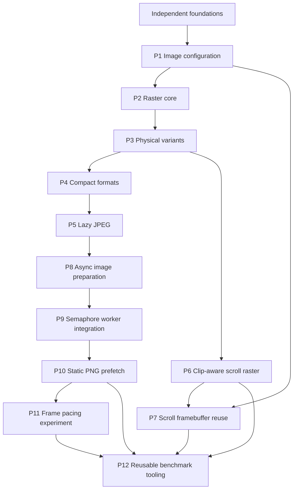

<!--
Copyright (C) 2026 Amalgam Solucoes em TI Ltda

SPDX-License-Identifier: LGPL-2.1-only
-->

# Image/rendering reconstruction map

Evidence baseline: `codex/scroll-raster-reuse-windows-package` at `f5dad132c`. The 13 named checkpoints are a single ancestor chain from `master`; `perf/image-scroll-prefetch` is an additional direct ancestor and is included where relevant. Treat these refs as evidence, not as branches to replay.

## Principles

- Rebuild the behavior in logical feature PRs; fold late fixes into their owner.
- Keep correctness tests; move reusable measurement tools out of runtime PRs.
- Drop generated results, logs, temporary packages, and experiments without durable value.
- Use the independent runtime-configuration and RuntimeDiagnostics foundations. Raw optimization masks are not the future public API.
- Generic Android download tools, standard streams, `System.nanoTime`, Semaphore V1 core, runtime configuration, and generalized diagnostics are external prerequisites; do not duplicate them here.

## Proposed final PR chain

Each entry names one logical PR. P11 is a benchmark-only sibling; P12 carries reusable tooling after its runtime contracts stabilize.

### P1 — Image configuration integration

**Branch/title:** `feat/image-runtime-config` — `feat(image): integrate image settings with runtime configuration`. **Base:** independent configuration/RuntimeDiagnostics foundations. **Owns/API:** central startup defaults (IDs 0–4 and 15 enabled; 5–7, 13–14 and scroll reuse off) through the foundation; old settings classes only as internal adapters, no invented keys. **Sources:** phase 1 and fast-path startup corrections. **Tests/tools:** rewrite settings/default/accounting tests; control harness goes to P12. **Exclude:** generic foundations and inert cache-budget, pressure, GPU-discard, mmap placeholders.

### P2 — Native raster core

**Branch/title:** `perf/image-raster-core` — `perf(image): add zero-copy raster backing paths`. **Base:** P1. **Owns/API:** native backing/decode ownership, opacity metadata, opaque `writePixels`, bounded readback scratch/row batching, direct-color semantics, trivial draw plans, mutable-target invalidation; internal only. **Sources:** phase 1–2. **Tests/tools:** retain decode parity/ownership/retry, opacity mutation, writePixels/color/readback/draw-plan and native surface regressions; microbenchmarks go to P12. **Exclude:** caches, compact formats, lazy factories, public counters/hooks.

### P3 — Physical raster variants

**Branch/title:** `perf/image-raster-variants` — `perf(image): reuse physical raster variants`. **Base:** P2. **Owns/API:** exact identity folding before a bounded one-slot variant cache; eligible opaque target-color conversion; generation-aware invalidation and conservative software-target fallback. Internal plans only. **Sources:** phase 2 extensions and decode raster-policy audit. **Tests/tools:** retain identity, BGRA/RGB565, translucent fallback, geometry, mutation/replacement/eviction, disabled parity, and source-readback cases; measurements in P12. **Exclude:** GPU caches, approximate geometry, default-enabling IDs 13/14.

### P4 — Compact decoded formats

**Branch/title:** `feat/image-compact-formats` — `feat(image): support compact decoded backing formats`. **Base:** P3. **Owns/API:** opt-in RGB565, GRAY8, ARGB4444, promotion, compact `writePixels`, and target dispatch with canonical pixel/alpha semantics; internal format selection. **Sources:** phase 3. **Tests/tools:** retain per-format, promotion, adaptive-JPEG, final-stack, opacity/color and resource cases; isolated/combined matrices in P12. **Exclude:** mmap, eviction, GPU discard, unsupported platform claims.

### P5 — Lazy JPEG sources

**Branch/title:** `feat/image-lazy-jpeg` — `feat(image): defer JPEG factory materialization`. **Base:** P2 and P4. **Owns/API:** internal immutable decode policies/pipeline, preserved native path source, deferred payload decode, cached deterministic errors and retried transient errors. Keep eager argument/path/metadata and missing-file exceptions and existing factory signatures. **Sources:** JPEG factory branch and decode benchmark fixes. **Tests/tools:** retain encoded-source, lazy-materialization, best-fit, factory/compact smoke and ABI tests; measurements in P12. **Exclude:** public policy API or malformed-payload fallback.

### P6 — Clip-aware image raster path

**Branch/title:** `perf/image-scroll-raster-fast-path` — `perf(image): clip physical raster draws to visible regions`. **Base:** P3 (P5 only for lazy-source fixtures). **Owns/API:** exact visible physical subrect planning before clip mutation, eligible physical-only copies, handled no-op semantics, `copyRect` draw-plan integration and conservative fallback; no new public API/ID. **Sources:** all three fast-path plans and late copyRect/cache fixes. **Tests/tools:** keep clipped/no-intersection/hash/mutation/fallback/copyRect/default regressions and customer fixture; runner in P12. **Exclude:** async cold decode, new cache, public diagnostics, unrelated Windows startup investigation.

### P7 — Scroll framebuffer reuse

**Branch/title:** `perf/ui-scroll-raster-reuse` — `perf(ui): reuse framebuffer rows during vertical scroll`. **Base:** P1 and P6 ScrollContainer path. **Owns/API:** conservative vertical software raster row-move plus exposed-strip repaint, full-present behavior and full-repaint recovery; internal only, default off. macOS paint savings had worse tails and Windows frame/screen tails were mixed, so claim no general speedup. **Sources:** reuse POC and final Windows profile fixes. **Tests/tools:** keep native hashes/move, waypoint, repaint/fallback/recovery, 2/4-byte width and diagnostics-off checks; matrix in P12. **Exclude:** horizontal reuse, partial presentation, generalized damage tracking, default promotion.

### P8 — Asynchronous image preparation

**Branch/title:** `feat/image-async-prefetch` — `feat(image): prepare display images asynchronously`. **Base:** P5 and P1. **Owns/API:** descendant traversal; DRAW_READY/COPY_READY requests; detached background decode, UI-thread adoption/release, serialized batches, stale-batch invalidation and content-identity reuse. Keep `ScrollContainer.prepareForDisplay`; internals remain private. **Sources:** image-scroll-prefetch through thread-diagnostics and decode fixes. **Tests/tools:** keep traversal, lifecycle, retry, cache identity, stale-batch and smoke tests; cold/warm matrix in P12. **Exclude:** viewport prediction/eviction, worker pool, decoder redesign.

### P9 — Semaphore prefetch worker

**Branch/title:** `feat/image-prefetch-worker` — `feat(image): add serialized semaphore prefetch worker`. **Base:** P8 plus independent Semaphore V1 core. **Owns/API:** image queue wakeup/serialization/lifecycle only; legacy per-entry threads stay default, worker modes opt-in absent comparable results. **Sources:** image-specific semaphore and worker portions. **Tests/tools:** retain balanced wake, serialization, shutdown/reset, queue/adoption tests; timing in P12. **Exclude:** generic Semaphore API/stress suite and new thread APIs.

### P10 — Static PNG prefetch

**Branch/title:** `feat/image-png-prefetch` — `feat(image): prefetch static PNG sources`. **Base:** P8/P9. **Owns/API:** static PNG on the existing queue via Java-result candidate; animated PNG/other formats remain unsupported; no public API or VM changes. **Sources:** `feat/png-prefetch` and integrated scroll workload. **Tests/tools:** keep ordinary/indexed readiness, dimensions, reuse, release/discard and 663/663/0/0 contract; format/runner checks in P12. **Exclude:** PNG downsampling, detached native handles, multi-frame PNG.

### P11 — Frame pacing experiment

**Branch/title:** `perf/frame-pacing-diagnostics` — `perf(ui): compare frame scheduling policies`. **Base:** nanoTime/standard-stream foundations and P10 integrated workload. **Owns/API:** one internal Flick advancement path and test-only comparisons for drivers, clocks, deadlines, SDL wait/poll and yield. Preserve TimerEvent/40 fps, millisecond clock, relative deadlines, SDL polling and legacy yield; three samples/config on one Mac and an unrun Windows matrix do not establish a winner. **Sources:** frame-pacing branch. **Tests/tools:** keep deterministic Flick/native helper tests; runners in P12. **Exclude:** public pacing settings, default changes, energy claims, busy-spin, Windows waitable timer.

### P12 — Reusable benchmark tooling

**Branch/title:** `perf/image-rendering-benchmarks` — `perf(tooling): package image rendering benchmarks`. **Base:** P6–P11 contracts plus standard streams/nanoTime. **Owns/API:** repeatable scroll/decode/prefetch/reuse/pacing runners, package manifests, corpus validation and static runner contracts; keep the 663-image corpus external and migrate old mask arguments through P1. **Sources:** phase harnesses, distributed scroll/decode, Windows reuse package, pacing tools. **Tests/tools:** candidate final runners, packagers/aggregators, prefetch and PowerShell scripts, provenance and cold/warm parsing tests; Agent E selects the durable subset. **Exclude:** raw results/logs, generated binaries/TCZs, temporary ZIPs and one-off analysis scripts.

## Change classification matrix

| Historical change | Classification | Destination PR | Final treatment |
|---|---|---|---|
| Phase 1 harness/RSS runner | MOVE | P12 | Keep reusable runner; drop outputs. |
| Public image masks, feature IDs, thresholds | MOVE | P1 | Replace with foundation config; adapter may stay internal. |
| Accounting gate and clear/reset semantics | FOLD | P1 | Migrate to RuntimeDiagnostics; retain disabled-path tests. |
| Zero-copy backing, decode ownership/retry/cleanup | KEEP | P2 | Preserve parity and lifetime rules. |
| Opacity metadata and mutation invalidation | KEEP | P2 | Preserve proof and generation invalidation. |
| Opaque writePixels, color/alpha parity, draw plans | KEEP | P2 | Keep tested fast paths and fallbacks. |
| Bounded readback scratch and row batching | KEEP | P2 | Preserve allocation/row semantics. |
| Mutable-target invalidation and allocation-failure fixes | FOLD | P2 | Fold in; keep failure injection test-only. |
| Exact identity folding/software-target restrictions | KEEP | P3 | Preserve exact checks and precedence. |
| Target-color conversion and translucent fallback | KEEP | P3 | Keep eligible BGRA/RGB565; source remains canonical. |
| One-slot physical variants, eviction, generations | KEEP | P3 | Preserve bounded cache and invalidation. |
| RGB565, GRAY8, ARGB4444 and promotion | KEEP | P4 | Keep compact formats opt-in. |
| Compact conversion/writePixels/opacity fixes | FOLD | P4 | Fold into format implementation. |
| JPEG policies, lazy factories, native source retention | KEEP | P5 | Keep policy internal and payload decode lazy. |
| Eager missing-file errors and transient retry | FOLD | P5 | Preserve exception timing and retry corrections. |
| Clipped physical subrects and handled no-op draws | KEEP | P6 | Keep exact copies; no-op must not mutate target. |
| copyRect plans, direct cached copies, fallback | KEEP | P6 | Keep parity and generic fallback. |
| Fast-path fixture and correctness matrix | KEEP | P6 | Keep fixture; runner moves to P12. |
| Abandoned Windows startup/heap/register investigation | DROP | — | Unrelated pre-fixture VM issue. |
| Distributed scroll/decode runners and corpus packagers | MOVE | P12 | Audit scripts; corpus/results stay external. |
| Native screen-row move and dirty-strip repaint | KEEP | P7 | Keep conservative vertical path and recovery. |
| Pixel width, repaint-state and post-move corrections | FOLD | P7 | Fold into eligibility/recovery tests. |
| Reuse counters, profiles, Windows runner/package | MOVE | P12 | Keep runner contracts; no broad speedup claim. |
| Async preparation and ScrollContainer traversal | KEEP | P8 | Keep explicit entry point and request outcomes. |
| Detached decode/adoption, batching, identity, stale-batch fixes | KEEP | P8 | Keep as one lifecycle design. |
| Legacy preparation serialization/lifecycle | KEEP | P8 | Keep legacy as default. |
| Worker polling and detailed worker timings | MOVE | P12 | Test/measurement modes only; no default change. |
| Generic Semaphore V1 core/stress suite | MOVE | Foundation | Consume independent work; do not duplicate. |
| Image queue Semaphore integration | KEEP | P9 | Keep image-specific wake/lifecycle; legacy default. |
| Static PNG Java-result path and readiness fixes | KEEP | P10 | Keep static PNG; no VM changes. |
| PNG result artifacts and Windows runner | MOVE | P12 | Keep durable contracts; drop raw results/bundles. |
| Shared Flick advancement | FOLD | P11 | Keep internal contract; preserve behavior. |
| Driver/clock/deadline/SDL wait/yield selectors | MOVE | P11 | Test-only experiments; retain production defaults. |
| Frame runners, helper tests, static contracts | MOVE | P12 | Keep reusable test/tooling subset. |
| nanoTime and standard-stream implementation | MOVE | Foundation | Consume independent primitives. |
| Final Windows profile, manifest, PowerShell helpers/tests | MOVE | P12 | Keep source tooling after config migration. |
| Benchmark-only tcsdl pixel-format stderr print | DROP | — | Remove one-off native hook. |
| Raw results/logs, generated binaries/ZIPs, plans, one-off scripts | DROP | — | Do not replay exploratory artifacts. |

**Group counts:** KEEP 18, FOLD 6, DROP 3, MOVE 11 (38 rows).

## Late corrections to fold

- **P1:** Gate every Java/native accounting field together; clear must not enable diagnostics; centralize defaults to avoid startup cycles.
- **P2:** Include APPLY_COLOR2 alpha parity (`0xAAxxxxxx`), alias/generation invalidation, allocation-failure cleanup/retry, stable decode masks, and mutable-target opaque-copy fixes. Failure hooks stay test-only.
- **P3/P4:** Preserve identity-before-variant, exact eviction/generation checks, direct target-color materialization, native test registration/signatures, compact row conversion, promotion, opacity, and accounting fixes.
- **P6:** Distinguish unhandled, handled-no-op, and handled-mutated. A clipped-out draw leaves generation/opacity/cache/pixels unchanged; keep copyRect preference and fallback fixes.
- **P7:** Use physical pixel width, preserve unrelated repaint state, and fully repaint after post-move failure.
- **P8/P10:** Release discarded candidates; adopt on UI thread; keep DRAW_READY/COPY_READY, active-batch attachment/invalidation, content identity; PNG uses Java-result and not JPEG-native counters.
- **P11/P12:** Keep the zero-delta plateau fixture and bounded evidence-writer corrections; neither justifies changing pacing defaults. Fold Windows runner parsing/assertion fixes into tooling.

## Public API migration

Remove public `setMask/getMask/getEffectiveMask` controls; use the independent runtime-configuration contract without defining keys here. The two historical settings classes may survive only as internal adapters. Drop inert budget, pressure-eviction, GPU-discard, and mmap slots unless separately implemented. Preserve Image factory signatures and eager path/metadata exceptions; keep decode policies/pipeline/candidates internal. Keep `ScrollContainer.prepareForDisplay`; expose no masks, counters, failure hooks, or benchmark selectors.

## Diagnostics migration boundary

| Instrumentation | Classification | Treatment |
|---|---|---|
| Opt-in aggregate image counters | production-safe candidate | Use RuntimeDiagnostics; disabled path must avoid new clock/counter work. |
| Feature hits/bytes/fallbacks, reuse frames/paint, decode/prefetch timings | benchmark/test-only candidate | Keep in smoke/benchmark output, without stable public schema. |
| `ForTest` getters/resets, fault injection, worker selectors, frame observers | benchmark/test-only candidate | Retain only for regression tests/reusable measurements. |
| Mask-gated duplicate registries, raw output, one-off native print | obsolete/drop | Fold or remove. |

No RuntimeDiagnostics API design is made here.

## Benchmark/tooling boundary

Keep deterministic smoke fixtures beside owning runtime tests. P12 candidates: final scroll/decode runner and packager, corpus checks, prefetch/reuse/frame-pacing runners, manifests, result parsers, and static contracts. Keep the 663-image corpus external; Agent E selects the durable subset.

Drop raw `.agent/benchmarks`/evidence, logs, generated SDK/TCZ/JAR/binaries, temporary ZIPs, machine paths, intermediate plans/state, one-off tail analysis, and the tcsdl print.

## Dependency graph

The foundation node means existing independent work, including Semaphore V1 for P9, nanoTime/standard streams for measurement, and configuration/diagnostics for P1. P11 is a benchmark-only sibling of the product runtime; it preserves current scheduling defaults.

## Reconstruction risks

- Later variant/copyRect fixes supersede early phase-2 tips; build P3/P6 from final semantics.
- Java/native startup and registration cross files; compact formats, variants and mutation interact, so retain combined tests.
- Prefetch depends on detached ownership, UI adoption, serialization, content identity and batch invalidation.
- Reuse reduces active paint work but has mixed full-present tails; keep opt-in.
- One fast-path Windows run failed before fixture startup; the later reuse package tests a different path.
- Frame data is three samples/config on one Mac; the Windows matrix was not run.

## Open decisions

None remain for architecture. The runtime-configuration foundation owns configuration key details; rollout defaults and experiment-only statuses above are resolved by the historical defaults and available evidence.

## Validation of this analysis

- Compared every named checkpoint to its predecessor and inventoried material changes; confirmed the ordered ancestry and included direct ancestor `perf/image-scroll-prefetch`.
- Inspected final image/decode/preparation/scroll/Flick/SDL sources, archive/plan/report evidence, and the final Windows package diff.
- Mapped each material change in `codex/scroll-raster-reuse-windows-package` to P7/P11/P12 or an explicit DROP.
- Confirmed generic Semaphore, streams, nanoTime, Android download tools, runtime configuration and diagnostics remain external foundations.
- No platform builds or tests run; this is analysis only.
